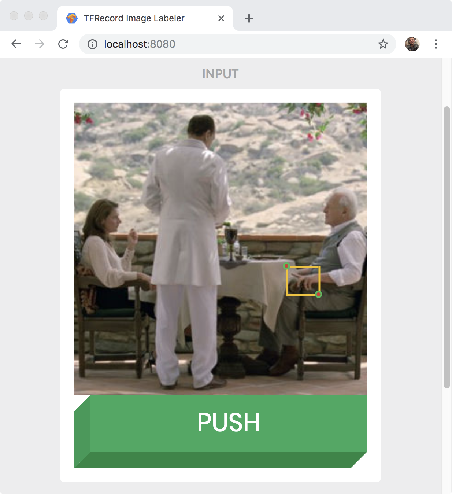

# TFRecord Image Labeler

## Purpose

TFRecord Image Labeler enables users to annotate images with bounding boxes and create an image dataset in TFRecord format used to retrain Tensorflow Object Detection API pre-trained models.

## Screenshot




## Design

TFRecord Image Labeler is a local web application and REST API.
It starts an HTTP server to present an HTML5 canvas for labeling images uploaded to a GCS bucket.
Each time the button is pressed, an Image reference is fetched from `/image` endpoint.
The Image is downloaded from the `/image/:imgId` endpoint, which maintains a read-through cache backed by the GCS bucket.
The Image is automatically resized to fit the labeling canvas.
Each for each label posted to the `/label` endpoint, a tf.Example is created and written to the output TFRecord.
A TFRecord file is output to the local filesystem.

## Setup

### Install Google Cloud application default credentials

`gcloud auth application-default login`


### Create your GCS bucket

`gsutil mb -c multi_regional gs://image-bucket`


### Upload your images to your GCS bucket

`gsutil cp *.jpg gs://image-bucket`


## Installation

`go get github.com/jasonmar/tfrecord-image-labeler`


## Usage

`tfrecord-image-labeler -bucket image-bucket -output images.tfrecord`


## Code generation

Proto files for tf.Example are copied from [tensorflow/core/example](https://github.com/tensorflow/tensorflow/tree/master/tensorflow/core/example)

```sh
curl -O https://raw.githubusercontent.com/tensorflow/tensorflow/master/tensorflow/core/example/feature.proto
curl -O https://raw.githubusercontent.com/tensorflow/tensorflow/master/tensorflow/core/example/example.proto
mkdir -p vendor
sed -i -e 's|import "tensorflow/core/example/feature.proto";|import "feature.proto";|' example.proto
protoc -I . *.proto --go_out=./vendor
```


## Disclaimer

This is not an official Google project.
